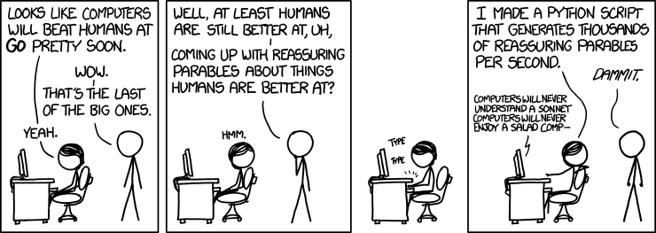

# Methods of word normalization
An important step in data mining

---

## Sentence Tokenizing

#### The idea

"Splitting sentences is easy! You just look for periods, etc., and split based on those, right?"

Well, what about these?

* Titles: Mr., Mrs., Dr.
* Abbreviations: St., Ave., Rd., Mt. Everest, U.S.A 
* Ellipsis: ...

#### How academics do it
1. Statistical inference
2. Regex Rules
3. Tokenize, then use sentence splitting

#### How we can do it

```python
from nltk.tokenize import sent_tokenize

sentence = "Hello. Hello there. What is your name?"
sent_tokenize_list = sent_tokenize(sentence)
```

#### References:

[Grammarly's explanation](http://tech.grammarly.com/blog/posts/How-to-Split-Sentences.html)
[Dive into NLTK: Sentence Tokenizing](http://textminingonline.com/dive-into-nltk-part-ii-sentence-tokenize-and-word-tokenize)



## Word Tokenizing

A good rule to follow: 
1. Make everything the same case. Standard procedure is to make everything lower case.
```python
sentence = "HELLO"
sentence = sentence.toLower()
# sentence is "hello"
```

Although word tokenizing seems as simple as sentence tokenizing does, here are some possible concerns.

1. O'Neill -> [neill]; [oneill]; [o'neill]; [o', neill]; [o. neill]
2. Aren't -> [arent]; [aren't]; [are, n't]; [are nt]

#### How we can do it

```python
from nltk.tokenize import word_tokenize

sentence = "Buffalo buffalo buffalo Buffalo buffalo Buffalo buffalo"
tokenized_words = word_tokenize(sentence)
```


#### References
[Stanford NLP Explanation of Word Normalization](http://nlp.stanford.edu/IR-book/html/htmledition/tokenization-1.html)
[UF CompLing Project on Word Normalization](https://github.com/UF-CompLing/Word-Normalization)

## Lemmas
**The problem**: Sometimes when finding the frequencies of certain pieces of text, we find multiple forms of the same word.

A noun:

1. John

2. John's

3. Johns

4. john

A verb:

1. is

2. are

3. am

4. being

#### What do we do?

Lemmatization creates common forms of such words, and spits out those common forms whenever input a certain word

#### How we can do it

```python
from nltk.stem import WordNetLemmatizer
wnl = WordNetLemmatizer()
word = wnl.lemmatize("Aren't")
```


## Putting it all together
Here's a sample code chunk, which does everything discussed in this document!

```python
# imports
from nltk.tokenize import sent_tokenize, word_tokenize
from nltk.stem import WordNetLemmatizer

# initialize things
_in = "Hello there, stranger. Aren't you glad to read me?"
_out = '' # blank for now
Lemmatizer = WordNetLemmatizer()

# split up the sentences. Also make them lower case
sentences = sent_tokenize(_in).toLower()

# run through each sentence
for sentence in sentences:
    
    # split up the words
    words = word_tokenize(sentence)
    
    # run through each word
    for word in words:
        
        # lemmatize
        lemmatized = wnl.lemmatize(word)
        
        # add space before word, if not first word
        if _out is not '':
            _out += ' '
        
        # add this to the output string
        _out += lemmatized
    
    # end of sentence
    _out += ". "    
```
