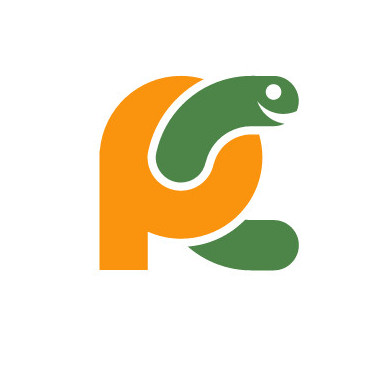

# Our "Stack"

Bonjour to the Computational Linguistics Club!

Programmers call the set of tools they use their "stack". This page is dedicated to getting your "stack" set up. Enjoy!

## Python

Download Python [here](https://www.python.org/downloads/). 

Though the differences between Python 3.x and 2.x don't make too much of a difference for our uses, we recommend Python 2.x as that is what most other club members are using.

## Git

Download Git [here](https://git-scm.com/downloads).

Learn about Git [here](Git.md "Git").

## Pycharm

Download PyCharm [here](https://www.jetbrains.com/pycharm/download/). The "Community" version is free, so we recommend that one.

So what is an IDE anyway?
* Here's [our](IDE.md) TLDR on what to type on.
* Here's [Wikipedia's](https://en.wikipedia.org/wiki/Integrated_development_environment).
* Here's a good [Mashable](http://mashable.com/2010/10/06/ide-guide/#8ixAwksnyuqZ) article.

## NLTK

