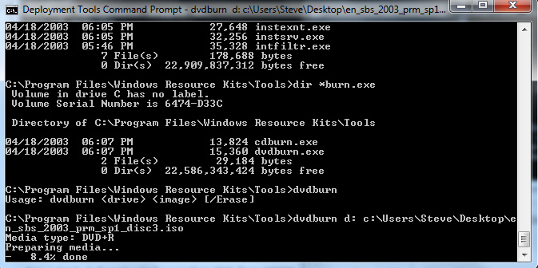
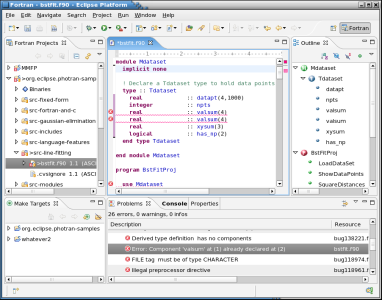

## This is the Command Line

It looks like "The Matrix", right? You create and run your files here.

## This is a Text Editor

You edit your files here, and use the Command Line to run them.

## This is an Integrated Development Environment (IDE)

You create, run, and edit your files here. PyCharm is an IDE.