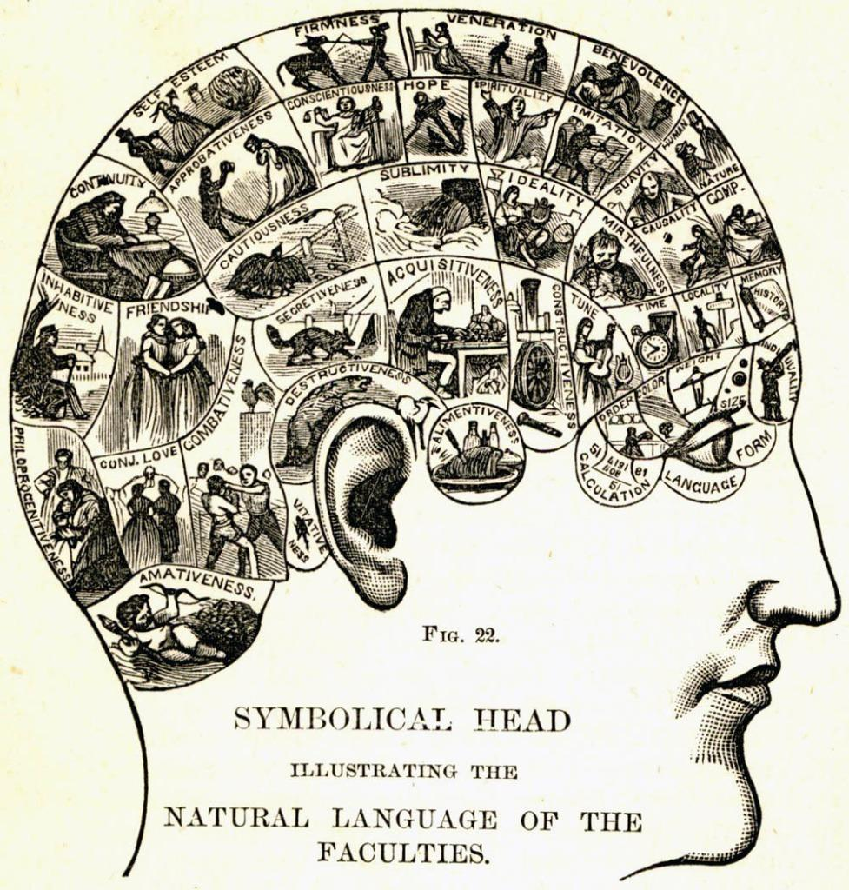

# Resources

Welcome to the Computational Linguistics Club's creative workspace! We're so excited to have you here.

## Just getting started?

We can get you oriented!

- Never coded before?
- Coded before, but never with us?

## Learn about our projects!

We have tons of fantastic projects, just for you.

## Reach out

Our leadership consists of:

 - Hali Lindsay, Co-Founder.
 - Noah Rucker, Co-Founder.
 - Danny Sepler, Co-Founder. dannysepler@gmail.com.

Contact Danny for tech concerns, and access to the repo.